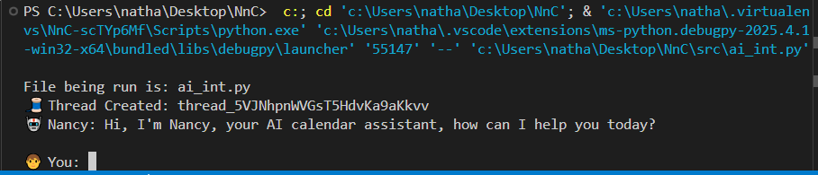

# NnC - Nextcloud AI Calendar Assistant

## Contents

[Project Overview](#project-overview) |
[Project Background](#project-background) |
[Getting Started](#getting-started) |
[Testing](#testing) |
[Project Brief & Timeframe](#project-brief) |
[Technologies Used](#technologies-used) |
[Result](#result) |
[Development Lifecycle](#development-lifecycle) |
[Wins](#wins) |
[Challenges](#challenges) |
[Bugs & Future Improvements](#bugs-and-future-improvements) |
[Key Learnings](#key-learnings) |
[Supporting Info](#supporting-info)

---

# Project Overview

NnC (Nancy) is an AI-powered assistant that enables User abstracted interaction with a Nextcloud calendar via a command-line "chat" interface. The assistant leverages OpenAI's function calling and the `caldav` package to execute CREATE ONLY calendar operations  on a NextcloudPi instance running on a local network. It processes natural language inputs and determines whether to call a create function or get more information, and reports back to User.

---

# Project Background

The desire for an AI-integrated personal calendar assistant came from wanting ownership of own calendar on local server, as well as an open source(ish) AI assistant that could execute calendar actions rather than navigating Nextcloud’s UI. Many voice assistants and calendar automation tools exist but do not integrate well with **self-hosted solutions** like NextcloudPi. The challenge was to create a **mostly local AI-driven** interface that interacts with a personal Nextcloud calendar while maintaining modularity and future expandability.

---

# Getting Started

To set up and run NnC, follow these steps:

### **Prerequisites**
- A running **NextcloudPi** instance with CalDAV enabled
- A **Python 3.9+** environment
- An **OpenAI API Key**
- An **OpenAI API Premium subscription** for assistants and increased API limits
- Required dependencies (see `Pipfile`)

<!-- TODO: installation steps for pipenv -->
### **Installation Steps**
1. Clone this repository:
   ```sh
   git clone git@github.com:nedd-ludd/NnC.git
   cd nextcloud-ai-assistant
   ```
2. Install dependencies:
   ```sh
   pipenv install -r requirements.txt
   ```
3. Set up environment variables (create a `.env` file):
   ```ini
   OPENAI_API_KEY=your-api-key-here
   NEXTCLOUD_URL=http://192.168.1.100/remote.php/dav
   NEXTCLOUD_USER=your-username
   NEXTCLOUD_PASS=your-password
   ```

4. In OpenAI's assistants, copy START_INSTRUCT text from OAI_TOOLS.py:

    ```python
    ##OpenAI Client
    NAME = "NnC (Nancy) Nextcloud Calendar Assistant"
    START_INSTRUCT = """
        You are an AI ass....
      ```
5.  and copy FUNCTION_CALLS dict into json:

    ```python
    #Function Calls
    CREATE = {
        "name": "create_calendar_event",
        "description": "Create an iCalendar event using RFC 5545 fields. This function returns a non-allday event, i.e has DTSTART and DTEND in ISO 8601 format.",
        "parameters": ....}
    ```

6. Add OpenAI API key and assistant ID to .env file:

    ```ini
    #OpenAI
    OPEN_KEY=sk-proj-xxxxxxxxxxxxxxxxxxxxxxxxxxxxxxxxxxxxxxxxxxxxxxxxxxxxxxxxxxxxxxxxx
    ASS_ID=asstxxxxxxxxxxxxxxxxxxxxxxxx
    ```

4. cd to src folder and run the assistant:
   ```sh
   python src/ai_int.py
   ```

---

<!-- # Testing

To test functionalities, use the CLI:

### **Example Commands**
```sh
python src/face.py "Add Noisily Festival to my calendar from July 11th to July 14th in the UK."
```
```sh
python src/face.py "What events do I have this Friday?"
```
```sh
python src/face.py "Cancel my meeting on Wednesday."
```
Check logs in `logs/` for debugging information.

--- -->

# Project Brief

## **Functional Requirements**
- Interpret natural language inputs and map them to CalDAV action(s).
- Support **Create** operation only (MVP).
- Maintain a conversational flow that allows follow-up commands.

## **Non-Functional Requirements**
- Securely authenticate with Nextcloud.
- Modular architecture for easy expansion.

## **Deliverables**
- Command-line interface (`face.py`)
- AI interaction layer (`ai_interface.py`)
- Calendar integration (`calendar_caller.py`)
- Executive logic (`executive.py`)
- Modular CRUD operations (`crud_functions.py`)

---

# Technologies Used

| Category | Technologies |
|----------|-------------|
| **Languages** | Python |
| **AI & NLP** | OpenAI GPT-4 Assistants & function calling |
| **Calendar API** | CalDAV (Nextcloud) |
| **Operating System** | Linux (Raspberry Pi OS) |
| **Development Tools** | VS Code, GitHub |
| **Networking** | Local network API calls |

---

# Result

✅ Seamless generation of CalDAV for AI-driven event adding. 

✅ Works entirely within the terminal.

✅ Modular and scalable for future enhancements. (by adding more options to OpenAI json)

---

# Development Lifecycle

## **Research**
- RFC5545 / NextCloud CalDAV for fields, options, and datatypes.
- OpenAI: API, Assistants, File Uploading, Function Calling

*(See research.md for more info)*

## **Planning**
- Defined core modules: AI interaction, CRUD operations needed, Nextcloud integration.
- Considered potential pitfalls (e.g., ambiguous commands, handling multiple events).

## **Execution**
- Implemented OpenAI function calling via OpenAI UI Start Instruction and json function call options.
- Everything is handled within ai_int, inc follow-up actions.
- Developed a clean API for calendar interactions.

---

# Wins

- 🎯 Successfully interfaced **AI with Nextcloud** via CalDAV.


- 💡 **Scalable** design allows additional features like read update and delete - just add to json.
- 🚀 **Reasonably local** (no need for external services beyond OpenAI API calls).

---

# Challenges

- **OpenAI learning curve and limitations** - Getting used to whats required for OAI, and find it limited to add persistant knowledge.
- **OpenAI API Call Optimization** - Reduced unnecessary calls by batching requests.

---

# Bugs & Future Improvements

### **Known Issues**
- **DOESN'T KNOW TODAY'S DATE** -If saying "next wednesday" it isnt aware of today. Need to be able to send something like "data.txt" with todays date and maybe some preferences to help the LM.
- AI sometimes **misinterprets vague follow-ups**. Need to keep clarifying as it doesnt make reasonable assumptions.
- Lacks a **GUI interface** (CLI only for now).
- Cant securely connect via HTTPS, told to ignore for now.

### **Planned / potential Enhancements**
- Re-assess anything... mainly architecture, perhaps with **local Small Language Model** to reduce latency
- Full **CRUD** rather than just add (create).
- Need some way of adding **anticipatory intelligence** that assistants have. This could be done from adding knowledge
- Add a **GUI interface** for non-technical users. 
- Adding **Nextcloud UID** - Entries logged without this outside of Nextcloud processing, may away from caldav and;
- Direct **.db access** to reduce latency (with strict datacleansing)
- Implement **recurring events** support. 
- Improve **event conflict resolution logic**.  
- Support for **multiple calendars** (e.g., work vs personal).  

---

**Feedback & Contributions Welcome!** 

[Back to Top](#project-overview)

